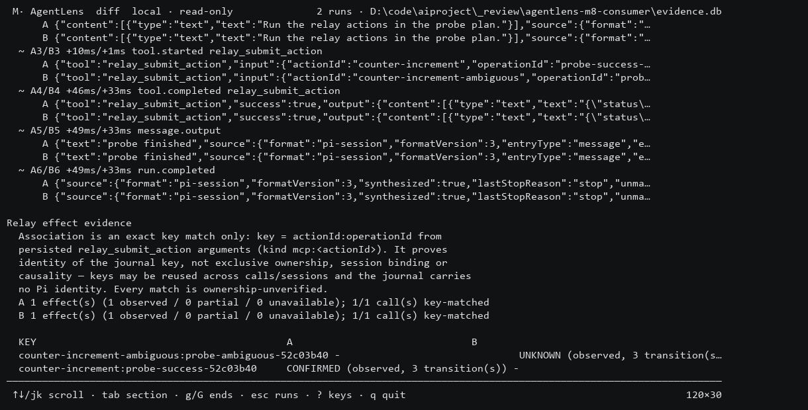

# M8 isolated evidence acceptance — 2026-09-26

Codex took over implementation and acceptance at the user's explicit request; no further Devin stage was dispatched. Reviewed the inherited `277844e` implementation and fixed pre-M8 database read-only compatibility in `74f460f`. PR: https://github.com/mat973252/agentlens/pull/7.

## Verified scope

- Windows Node24.13, pnpm10.17.1: fresh frozen install, lint, all 225 tests, build passed. The new compatibility regression first failed on schema-v1 reads, then passed with database bytes and mtime unchanged. Writable opens still migrate; read-only inspection never migrates.
- npm pack and installation into a separate consumer directory passed. Packaged CLI imported the three actual generated Pi session fixtures and their offline Relay history exports; success/UNKNOWN/two-call evidence stayed separate from normalized Run/tool data. Six input hashes and mtimes remained unchanged.
- Tests cover invalid schema/status/chain/coverage/duplicate sequence, snapshot conflicts, missing arguments, mismatched kind, reused keys, unmatched evidence, legacy history, duplicate import/rollback and secret sentinel exclusion from new evidence storage. Existing source Pi payload semantics remain unchanged.
- Actual Windows ConPTY: 80x24 home/detail, Relay evidence pager, resize to 120x30, A/B diff, NO_COLOR overriding explicit truecolor, keyboard navigation and quit. Captured output contained CONFIRMED and UNKNOWN, ownership limitations and missing Recovery. No color SGR under NO_COLOR; cursor/alternate screen restored. Database SHA-256 and mtime unchanged. The images below render captured terminal cells, not a mock UI.
- Ubuntu Node22/24 CI passed for `74f460f`: https://github.com/mat973252/agentlens/actions/runs/36212822916. Final documentation/main CI is checked separately after integration.

## Acceptance limits

The offline evidence adaptation and isolated dogfood are accepted. This is not production adoption or complete Run/Step/Recovery coverage. Fixtures came from actual Pi AgentSession with a deterministic local fake model, customTools-to-MCP bridge and loopback fake provider; token usage in them is simulated.

Exact actionId/operationId and MCP kind match proves journal key identity only. It does not prove exclusive ownership, session binding or causality; keys can be reused, journal carries no Pi identity, and clocks are not causally merged. UNKNOWN remains UNKNOWN even when normalized Pi Run passes. Missing Recovery remains unknown/unrecorded; old journal events are not invented.

Relay overall safety gate remains closed: real-provider completion/reconcile contract and non-protocol local writers are outside this acceptance. No Step6/7, real external effect, native Pi MCP integration or npm publication is claimed. Windows Terminal application and Node22.13 minimum patch were not individually tested.
